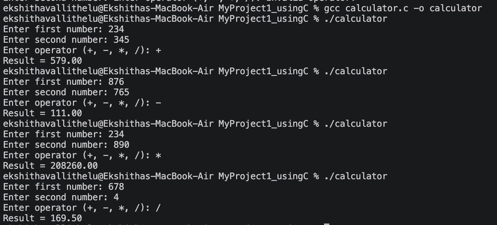

# 🧮 Calculator Using C

## 📌 Overview

This project is a simple calculator application developed using C programming language. It performs basic arithmetic operations through a menu-driven interface.

## ✨ Features

- Addition
- Subtraction
- Multiplication
- Division

## 🛠 Technologies Used

- C Programming Language
- GCC Compiler
- Git
- GitHub

## 🚀 How to Run

Compile the program:

```bash
gcc Calculator.c -o Calculator
```

Run the program:

```bash
./Calculator
```

## 📂 Project Structure

MyProject1_usingC
│
├── Calculator.c
├── README.md
└── .gitignore

## 📸 Screenshot



## 👩‍💻 Author

Ekshitha

B.Tech CSE Student

Andhra University
